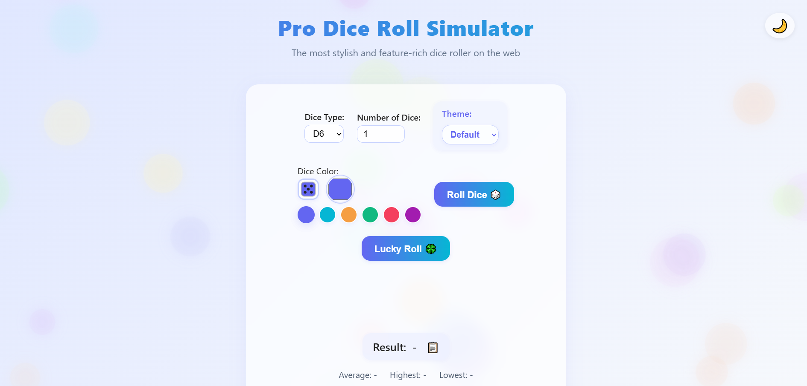

# Pro Dice Roll Simulator

A stylish, professional, and feature-rich dice roll simulator for web and mobile. Instantly roll any dice, customize appearance, and enjoy a premium experience—now installable as a PWA!

---

## ✨ Features
- Modern, responsive UI with glassmorphism and animated backgrounds
- Roll D4, D6, D8, D10, D12, D20 (multiple dice at once)
- Animated dice with realistic faces and custom color
- Theme customization: Default, Retro, Neon, Wood, Casino
- Custom dice faces: upload your own image or emoji
- Roll history and statistics (average, highest, lowest)
- Sound effects and vibration (mobile)
- Confetti and fun effects for special rolls
- Installable as a Progressive Web App (PWA) with offline support

---

## 📸 Screenshots

  

---

## 🚀 Installation & Usage

 As a PWA (Installable App)
- Open the site in Chrome/Edge/Brave (desktop or Android).
- Click the install icon in the address bar, or use "Add to Home Screen" on mobile.
- The app works offline and launches in full-screen mode!

---

## 🎲 Customization
- **Themes:** Instantly switch between beautiful themes in the controls.
- **Dice Color:** Pick any color or use a preset.
- **Custom Dice Face:** Upload an image or enter an emoji for your dice (D6).

---

## 🙏 Credits
- Created by [beshoy rezk](https://github.com/beshoy-rezk-tech)

---

## 📝 License
MIT License. Free for personal and commercial use. 